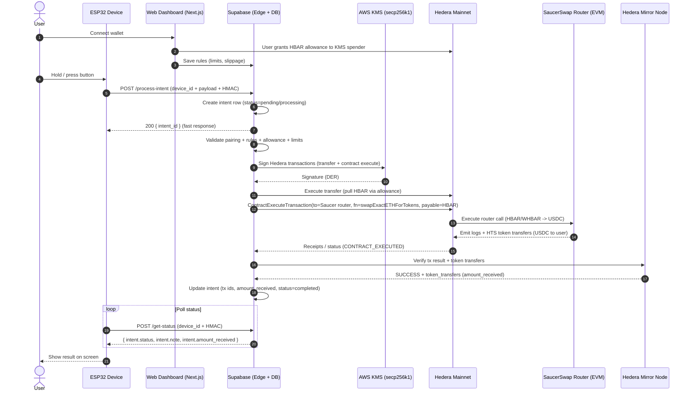
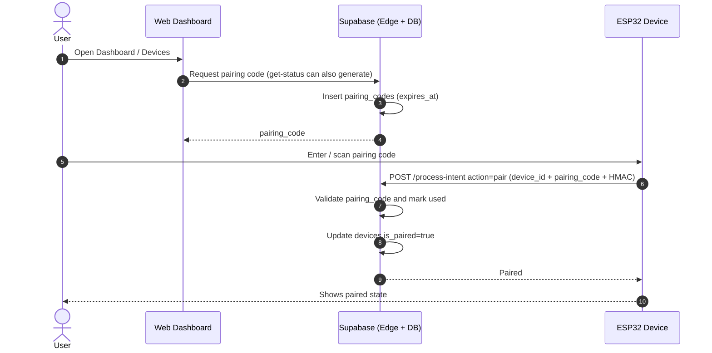

# Sweephy

Sweephy is a hardware-assisted Hedera swap experience: a physical device (ESP32) triggers a swap workflow, while a web dashboard provides pairing, rules, allowance setup, monitoring, and audit trails. Transaction signing is delegated to an AWS KMS-backed platform key, while users retain control through Hedera allowances.

## What’s in this repo
- Web app (Next.js) for onboarding, rules, admin, monitoring, audit logs.
- Device firmware (ESP32 Arduino) for pairing and “press-to-swap”.
- Supabase (Postgres + Edge Functions) as the backend API and state store.
- Hedera Mainnet integration (Transfers, ContractExecute for SaucerSwap router).
- AWS KMS signing flow for the platform operator key.

## Key features
- Device pairing via pairing code (device ↔ dashboard).
- One-click swap trigger from device (e.g. HBAR → USDC).
- Allowance-driven custody model: user grants allowance to platform signer; user can revoke any time.
- Rule engine (per user): amount per click, max per swap, daily limit, cooldown, slippage tolerance.
- Real-time dashboard stats + chart + recent activity.
- Audit logs and transaction details (transfer / swap / refund ids).
- Admin panel for device provisioning and management.
- Automatic refund on failure / timeout paths (backend side).

## Technology stack
- Frontend: Next.js (App Router), React, TypeScript, TailwindCSS, Recharts, Framer Motion
- Wallet integration: Reown AppKit (+ Hedera adapters)
- Backend: Supabase (Postgres + Edge Functions)
- Blockchain: Hedera Mainnet, `@hashgraph/sdk`
- Signing: AWS KMS (secp256k1), `@aws-sdk/client-kms`
- Swap: SaucerSwap Router contract (Hedera EVM)
- Device: ESP32 Arduino (WiFi, HTTPS, ArduinoJson, ST7789 display)

## Project structure
```
.
├─ device/                         # ESP32 firmware
│  ├─ sweephy.ino
│  └─ qrcode.*
├─ scripts/                        # Node scripts for ops/dev tooling
├─ src/                            # Next.js app
│  ├─ app/                         # App Router pages
│  ├─ components/
│  ├─ hooks/
│  └─ lib/
├─ supabase/
│  ├─ functions/                   # Edge Functions (Deno)
│  └─ migrations/                  # DB schema migrations
└─ env.example                     # Environment variables template
```

## Development setup

### Prerequisites
- Node.js (LTS recommended)
- Supabase project (cloud) or Supabase CLI (local)
- An AWS KMS key (ECDSA secp256k1) + AWS credentials (for KMS-backed signing)
- Optional: Arduino IDE / PlatformIO (to flash ESP32)

### Install
```bash
npm install
```

### Environment variables
Copy template:
```bash
cp env.example .env.local
```

Then fill values in `.env.local`.

### Run the web app
```bash
npm run dev
```

Open http://localhost:3000

### Lint and typecheck
```bash
npm run lint
npx tsc --noEmit
```

## Environment variables reference

The repository ships with [env.example](file:///Users/youvandrafebrial/Documents/trae_projects/sweephy/env.example) as a template. Variables fall into three buckets:

### 1) Next.js (public)
These are exposed to the browser (must be safe to expose).
- `NEXT_PUBLIC_SUPABASE_URL`
- `NEXT_PUBLIC_SUPABASE_ANON_KEY`
- `NEXT_PUBLIC_REOWN_PROJECT_ID`
- `NEXT_PUBLIC_KMS_ACCOUNT_ID` (spender account id used in allowance UI)
- Optional custom node:
  - `NEXT_PUBLIC_HEDERA_NODE_IP`
  - `NEXT_PUBLIC_HEDERA_NODE_ACCOUNT_ID`
- Admin page display fields (informational):
  - `NEXT_PUBLIC_KMS_KEY_ID`
  - `NEXT_PUBLIC_OPERATOR_ID`

### 2) Supabase Edge Functions (server-side)
Set these as Supabase function secrets (not in client env).
- `SUPABASE_URL`
- `SUPABASE_SERVICE_ROLE_KEY`
- `AWS_ACCESS_KEY_ID`
- `AWS_SECRET_ACCESS_KEY`
- `AWS_REGION`
- `AWS_KMS_KEY_ID`
- `KMS_ACCOUNT_ID`
- SaucerSwap / token constants:
  - `SAUCERSWAP_ROUTER_ID`
  - `WHBAR_TOKEN_ID`
  - `USDC_TOKEN_ID`

### 3) Local scripts (Node)
The `scripts/` folder uses Node environment variables. You can export them in your shell, or reuse `.env.local` by sourcing it:
```bash
set -a
source .env.local
set +a
```

Common script env vars:
- `AWS_ACCESS_KEY_ID`, `AWS_SECRET_ACCESS_KEY`, `AWS_REGION`, `AWS_KMS_KEY_ID`
- `KMS_ACCOUNT_ID`
- WHBAR unwrap helpers:
  - `WHBAR_CONTRACT_ID`
  - `WHBAR_TOKEN_ID`
  - `WHBAR_SPENDER_ID` (defaults to contract id)
  - `MIRROR_NODE_API`
- Deploy tooling:
  - `HEDERA_OPERATOR_ID`, `HEDERA_OPERATOR_PRIVATE_KEY`, `HEDERA_OPERATOR_KEY_TYPE`
  - `SWEEPHY_OPERATOR_ACCOUNT_ID`, `SWEEPHY_FEE_RECIPIENT_ADDRESS`

## Database (Supabase Postgres)

Schema is managed via SQL migrations in [supabase/migrations](file:///Users/youvandrafebrial/Documents/trae_projects/sweephy/supabase/migrations).

Core tables (simplified):
- `profiles`: user profile keyed by wallet address.
- `devices`: device inventory, pairing status, last seen, and ownership.
- `pairing_codes`: short-lived codes to pair a device to a profile.
- `rules`: per-profile swap rules (limits + slippage).
- `intents`: swap requests and their lifecycle.

Intent status values include:
- `pending` (created / waiting)
- `processing` (transfer/swap in progress)
- `completed` (swap confirmed)
- `failed` (failed and optionally refunded)

Swap detail fields on `intents` include:
- `tx_id_transfer`, `tx_id_swap`, `tx_id_refund`, `tx_id_receipt`
- `amount_received`
- `note` (human-readable status / error reason)

## Wallet integration

The web app uses Reown AppKit to connect wallets and identify users by `wallet_address`.

Main flows:
- **Grant allowance:** The UI constructs an `AccountAllowanceApproveTransaction` to approve HBAR allowance from the user to the platform KMS spender (`NEXT_PUBLIC_KMS_ACCOUNT_ID`).
- **Revoke allowance:** The UI sets allowance to 0.
- **Rules editing:** The UI writes to `rules` in Supabase.
- **Monitoring:** dashboard pages query `intents` and `devices` through Supabase client queries.

Key files:
- Dashboard rules UI: [rules/page.tsx](file:///Users/youvandrafebrial/Documents/trae_projects/sweephy/src/app/dashboard/rules/page.tsx)
- Supabase client: [supabase.ts](file:///Users/youvandrafebrial/Documents/trae_projects/sweephy/src/lib/supabase.ts)
- AppKit wiring: [web3-provider.tsx](file:///Users/youvandrafebrial/Documents/trae_projects/sweephy/src/lib/web3-provider.tsx)

## Device firmware (ESP32)

Firmware lives in [device/sweephy.ino](file:///Users/youvandrafebrial/Documents/trae_projects/sweephy/device/sweephy.ino).

High-level behavior:
- Connects to WiFi (provisioning via local web server + preferences).
- Calls Supabase Edge Function endpoints:
  - `process-intent` to request a swap
  - `get-status` to poll latest intent status and show progress
  - `get-price` for price display
- Uses HMAC signatures based on a per-device secret.

Important: do not hardcode production secrets in firmware for real deployments. Use a provisioning flow and store secrets securely (at minimum in NVS/Preferences).

## Supabase Edge Functions

Functions are in [supabase/functions](file:///Users/youvandrafebrial/Documents/trae_projects/sweephy/supabase/functions).

Key endpoints:
- `process-intent`: creates a new intent and runs the swap workflow asynchronously (transfer → swap → verify → update DB; refund on failure).
- `get-status`: device polling endpoint for pairing + latest intent.
- `get-price`: price endpoint used by device UI.
- `update-intents`: (internal/maintenance) intent updates.

## Sequence diagrams (Mermaid)

### Swap flow (device-triggered)


### Device pairing flow


## Important implementation notes

### Allowances (why it matters)
The platform KMS key does not custody user funds. Instead, it relies on Hedera allowance:
- User approves a limited HBAR allowance to the KMS spender account.
- KMS signs transactions to spend up to that allowance.
- User can revoke allowance at any time.

### Refund behavior
If transfer succeeded but swap fails or times out, backend attempts to refund HBAR back to the user and marks intent as `failed` with a `note`.

## Scripts

Scripts live in [scripts/](file:///Users/youvandrafebrial/Documents/trae_projects/sweephy/scripts).

Common examples:
- Deploy contract (see script usage inside file):
  - [deploy-sweephy-contract.ts](file:///Users/youvandrafebrial/Documents/trae_projects/sweephy/scripts/deploy-sweephy-contract.ts)
- Unwrap WHBAR from KMS account:
  - [unwrap-kms-whbar.ts](file:///Users/youvandrafebrial/Documents/trae_projects/sweephy/scripts/unwrap-kms-whbar.ts)
  - Run:
    ```bash
    npx tsx scripts/unwrap-kms-whbar.ts -- --all
    ```
- Withdraw HBAR from KMS:
  - [withdraw-hbar.ts](file:///Users/youvandrafebrial/Documents/trae_projects/sweephy/scripts/withdraw-hbar.ts)

## Troubleshooting

- Dashboard shows “Console Error {}”
  - Usually caused by logging a non-Error object. The codebase now formats unknown errors in dashboard logs via [format-error.ts](file:///Users/youvandrafebrial/Documents/trae_projects/sweephy/src/lib/format-error.ts).

- Device shows stuck “Swapping..”
  - Check latest intent in `intents` table (`status`, `note`, `tx_id_*` fields).
  - Verify Mirror Node shows SUCCESS for `tx_id_swap`.

- `SPENDER_DOES_NOT_HAVE_ALLOWANCE`
  - For swaps: user has not granted enough HBAR allowance to the KMS spender.
  - For WHBAR unwrap: token allowance for the WHBAR spender is required.

## Security notes (recommended hardening for production)
- Do not expose `SUPABASE_SERVICE_ROLE_KEY` to the client.
- Review Supabase RLS policies; current policies may be permissive for iteration speed.
- Rotate device secrets and avoid hardcoding secrets in firmware images.
- Add rate limiting and replay protection for device requests.
